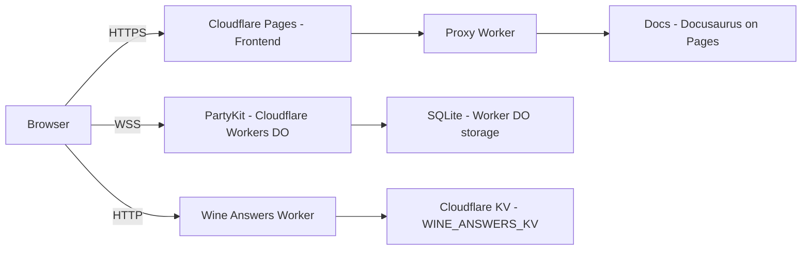

# Deployment Guide

This is the canonical deployment reference for Sommelier Arena. It covers all services, CLI-first deployment commands, and a full CI workflow example.

> **Rule of thumb:** use Wrangler CLI and `npx partykit deploy` for all deployments; avoid the Cloudflare Dashboard except for one-off manual tasks.

## Architecture



## Summary of services

- Frontend: Cloudflare Pages (front/)
- Backend: PartyKit (Cloudflare Workers Durable Objects) — deployed with `npx partykit deploy`
- Wine Answers Worker: Cloudflare Worker (wine-answers-worker/) — deployed with `npx wrangler deploy`
- Docs: Cloudflare Pages (docs-site/)
- Proxy Worker: Cloudflare Worker (proxy-worker/index.ts) — deploy with Wrangler

## Recommended automated flow (CI)

1. Build frontend artifact (`npm --prefix front run build`) and upload to Pages via API or Git push.
2. Build docs (`npm --prefix docs-site run build`) and upload to Pages as a separate Pages project.
3. After Pages projects are deployed, capture their pages.dev URLs and publish the proxy worker with `DOCS_ORIGIN` and other env vars injected via Wrangler or the Pages API.

## PartyKit (backend)

Deploy:

```bash
# From repo root
npx partykit login    # authenticate (first time)
npx partykit deploy
```

Notes:
- PartyKit publishes Durable Objects to a project-specific domain: `sommelier-arena.<your-username>.partykit.dev`.
- No Cloudflare account env vars are required for the PartyKit deploy step — PartyKit hosts the
  Worker and Durable Objects on its own Cloudflare infrastructure.

### Why HOSTS_KV is not bound

The `partykit.json` does **not** declare a `bindings.kv.HOSTS_KV` entry. Here is why:

When `CLOUDFLARE_ACCOUNT_ID` + `CLOUDFLARE_API_TOKEN` are set, PartyKit deploys the **entire
Worker and Durable Object** to your Cloudflare account (not its own). On the **free Cloudflare
plan**, Cloudflare requires new Durable Object namespaces to use a `new_sqlite_classes` migration.
PartyKit does not expose a migration configuration option, so this combination is blocked on the
free plan.

Without the binding, PartyKit deploys to its own infrastructure — the DO works correctly with
SQLite-backed storage. Session history falls back to `localStorage` (already the primary
mechanism — all reads and writes go through the browser first). The `upsertKvSession()` function
in `back/persistence.ts` is wrapped in `try/catch` and silently skips KV writes when no binding
is present.

> **To re-enable HOSTS_KV** (paid Cloudflare plan required):
> 1. Add `"bindings": { "kv": { "HOSTS_KV": "98082bb612964007aac177820469dddc" } }` back to
>    `partykit.json`.
> 2. Create a Cloudflare API token at `dash.cloudflare.com/profile/api-tokens` using the
>    **"Edit Cloudflare Workers"** template (Workers Scripts:Edit + Workers KV Storage:Edit +
>    Account Settings:Read).
> 3. Deploy: `CLOUDFLARE_ACCOUNT_ID=<id> CLOUDFLARE_API_TOKEN=<token> npx partykit deploy`

## Cloudflare KV (WINE_ANSWERS_KV)

The Wine Answers Worker serves curated answer suggestions for the session creation form.

### Deploy

```bash
cd wine-answers-worker
npx wrangler deploy
```

### KV namespace (WINE_ANSWERS_KV)

Create the KV namespace and bind it:

```bash
npx wrangler kv:namespace create "WINE_ANSWERS_KV" --account-id $CF_ACCOUNT_ID
# Add the namespace ID to wine-answers-worker/wrangler.toml bindings
```

### Environment variables

| Variable | Value |
|----------|-------|
| `ADMIN_SECRET` | Secret token for admin write access — set via `wrangler secret put ADMIN_SECRET` |

## Cloudflare Pages (Frontend & Docs)

### Frontend (Pages project)

- Root dir: `front`
- Build command: `npm run build`
- Output dir: `dist`

**Required build environment variables** (set in Cloudflare Pages → Settings → Environment Variables):

| Variable | Value | Why |
|----------|-------|-----|
| `PUBLIC_PARTYKIT_HOST` | `sommelier-arena.<username>.partykit.dev` | Backend WebSocket host — baked into the JS bundle at build time |
| `PUBLIC_WINE_ANSWERS_URL` | `https://sommelier-arena-wine-answers.<subdomain>.workers.dev` | Wine answer suggestions API — baked into the JS bundle at build time |

> ⚠️ **Both env vars are required.** They are embedded into the frontend at **build time** by
> Astro — not at runtime. If either is missing, the frontend falls back to `localhost` defaults
> which do not work in production. Symptoms: comboboxes show no suggestions; admin dashboard
> shows "Failed to fetch".
>
> After setting or changing these variables, **trigger a new Pages deployment** (push a commit
> or use the "Retry deployment" button in the Cloudflare dashboard).

### Docs (Pages project)

- Root dir: `docs-site`
- Build command: `npm run build`
- Output dir: `build` or as configured in docusaurus

## Proxy Worker (wrangler)

Use Wrangler to build & publish the TypeScript proxy worker (recommended):

```toml
# wrangler.toml (example)
name = "sommelier-arena-proxy"
main = "proxy-worker/index.ts"
compatibility_date = "2026-03-24"
```

Publish (example):

```bash
npx wrangler whoami
# Deploy with DOCS_ORIGIN injected (replace with actual pages.dev domain)
npx wrangler deploy --var DOCS_ORIGIN=https://sommelier-arena-docs.pages.dev
```

To create a route for `/docs*` programmatically, use the Cloudflare REST API:

```bash
curl -X POST "https://api.cloudflare.com/client/v4/zones/${ZONE_ID}/workers/routes" \
  -H "Authorization: Bearer $CF_API_TOKEN" \
  -H "Content-Type: application/json" \
  --data '{ "pattern": "sommelier-arena.ducatillon.net/docs*", "script": "sommelier-arena-proxy" }'
```

## Verification

- Visit `https://sommelier-arena.ducatillon.net/docs` and confirm the docs load.
- Confirm frontend loads at configured custom domain and connects to PartyKit via `PUBLIC_PARTYKIT_HOST`.

## Rollback

- Cloudflare Pages: rollback via Pages → Deployments.
- Workers: re-deploy previous bundle via Wrangler with the previous commit.

## Notes & CI recommendations

- Do not hard-code `DOCS_ORIGIN`; inject via CI or Wrangler `--var`.
- Store `CF_API_TOKEN`, `CF_ACCOUNT_ID`, `ZONE_ID` in GitHub Actions secrets and use them in CI steps.
- `PUBLIC_PARTYKIT_HOST` is baked into the frontend at build time. Capture the PartyKit URL after deploy and pass it as an env var when running `npm run build` in CI.

## CI/CD deployment workflow

The deployment sequence is the same regardless of your hosting provider:

1. **Deploy backend** (PartyKit / Cloudflare Workers) and capture the published host URL.
2. **Build and deploy docs** site.
3. **Build frontend** with `PUBLIC_PARTYKIT_HOST` baked in, then deploy to your static host.
4. **Deploy proxy worker** (if applicable) with the docs origin URL injected.

The example below uses **Cloudflare** (Pages + Workers + Wrangler). Adapt the deploy commands for your provider — the build steps and environment variable injection are identical.

> **Other providers:** Replace `npx wrangler pages publish` with `vercel --prod` (Vercel), `netlify deploy --prod` (Netlify), or your provider's CLI. The PartyKit deploy step (`npx partykit deploy`) is the same everywhere.

Save as `.github/workflows/deploy.yml` (manual trigger — adapt for push-to-main):

```yaml
name: CI/CD Deployment
on:
  workflow_dispatch:  # run manually; change to push: {branches: [main]} for auto-deploy

jobs:
  deploy:
    runs-on: ubuntu-latest
    env:
      CF_API_TOKEN: ${{ secrets.CF_API_TOKEN }}
      CF_ACCOUNT_ID: ${{ secrets.CF_ACCOUNT_ID }}
      CF_PAGES_PROJECT_NAME: ${{ secrets.CF_PAGES_PROJECT_NAME }}
      ZONE_ID: ${{ secrets.ZONE_ID }}
    steps:
      - uses: actions/checkout@v4

      - uses: actions/setup-node@v4
        with:
          node-version: '24'

      - name: Install root dependencies
        run: npm ci

      # 1. Deploy PartyKit backend and capture the published host
      - name: Deploy PartyKit backend
        run: |
          set -euo pipefail
          PARTYKIT_OUTPUT=$(npx partykit deploy 2>&1)
          echo "$PARTYKIT_OUTPUT"
          PARTYKIT_URL=$(echo "$PARTYKIT_OUTPUT" | grep -oE "https?://[a-zA-Z0-9.-]+\.partykit\.dev" || true)
          if [ -z "$PARTYKIT_URL" ]; then echo "PartyKit deploy did not return a URL"; exit 1; fi
          PARTYKIT_HOST=${PARTYKIT_URL#https://}
          echo "PARTYKIT_HOST=$PARTYKIT_HOST" >> $GITHUB_ENV

      - name: Deploy Wine Answers Worker
        run: |
          cd wine-answers-worker
          npx wrangler deploy

      # 2. Build and deploy docs site
      - name: Build docs
        run: npm --prefix docs-site ci && npm --prefix docs-site run build

      - name: Deploy docs to Cloudflare Pages
        # Replace with: vercel --prod ./docs-site/build  OR  netlify deploy --prod --dir docs-site/build
        run: npx wrangler pages deploy ./docs-site/build --project-name sommelier-arena-docs

      # 3. Build frontend with baked-in PartyKit host and Wine Answers URL, then deploy
      - name: Build frontend
        run: |
          npm --prefix front ci
          PUBLIC_PARTYKIT_HOST=$PARTYKIT_HOST \
          PUBLIC_WINE_ANSWERS_URL=${{ secrets.PUBLIC_WINE_ANSWERS_URL }} \
          npm --prefix front run build

      - name: Deploy frontend to Cloudflare Pages
        # Replace with: vercel --prod ./front/dist  OR  netlify deploy --prod --dir front/dist
        run: npx wrangler pages deploy ./front/dist --project-name $CF_PAGES_PROJECT_NAME

      # 4. Deploy proxy worker with docs origin injected (Cloudflare-specific)
      - name: Deploy proxy worker
        run: |
          npx wrangler deploy proxy-worker/index.ts \
            --account-id $CF_ACCOUNT_ID \
            --var DOCS_ORIGIN=https://sommelier-arena-docs.pages.dev
```

**Required GitHub Secrets:**
| Secret | Value |
|--------|-------|
| `CF_API_TOKEN` | Cloudflare API token (Workers:Edit, Pages:Edit, Zone:Edit) |
| `CF_ACCOUNT_ID` | Your Cloudflare account ID |
| `CF_PAGES_PROJECT_NAME` | Pages project name for the frontend (e.g. `sommelier-arena`) |
| `ZONE_ID` | Zone ID for `ducatillon.net` (needed only for custom routes) |
| `ADMIN_SECRET` | Secret token for Wine Answers Worker admin access |
| `PUBLIC_WINE_ANSWERS_URL` | URL of the Wine Answers Worker (baked into frontend at build time) |

<!-- end canonical deployment doc -->
